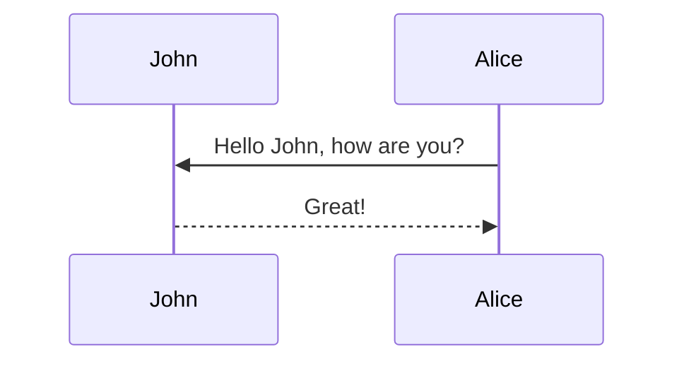

# Links
just like in [Obsidian](https://google.com)
or html:
<a href="url">link text</a>
# Tables
Same as obsidian:

| Left aligned | Center aligned | Right aligned |
| :----------- | :------------: | ------------: |
| Left 1       |    center 1    |       right 1 |
| Left 2       |    center 2    |       right 2 |
| Left 3       |    center 3    |       right 3 |
# Emojis
Uses markdown emojis
[List](https://emojipedia.org/)
# Math
$$
\sum_{k=1}^\infty |\langle x, e_k \rangle|^2 \leq \|x\|^2
$$

You can also use `\begin{equation}...\end{equation}` instead of `$$` for display mode math.
MathJax will automatically number equations:

\begin{equation}
\label{eq:cauchy-schwarz}
\left( \sum_{k=1}^n a_k b_k \right)^2 \leq \left( \sum_{k=1}^n a_k^2 \right) \left( \sum_{k=1}^n b_k^2 \right)
\end{equation}

and by adding `\label{...}` inside the equation environment, we can now refer to the equation using `\eqref`.

# Images
Creating images, see [[single image|single image]], [[triple image|triple image]]
[Image bootstrap grid](https://getbootstrap.com/docs/4.4/layout/grid/)


Slideshow:
```
<swiper-container keyboard="true" navigation="true" pagination="true" pagination-clickable="true" pagination-dynamic-bullets="true" rewind="true">
  <swiper-slide></swiper-slide>
  <swiper-slide></swiper-slide>
  <swiper-slide></swiper-slide>
  <swiper-slide></swiper-slide>
  <swiper-slide></swiper-slide>
</swiper-container>
```
Comparison:
```

  
  
</img-comparison-slider>
```

## Icons

Using [Font Awesome](https://fontawesome.com/search?m=free&o=r):

```html

# Maps
[Feojson](https://geojson.org/) code. The support is provided thanks to [Leaflet](https://leafletjs.com/). To create your own visualization, go to [geojson.io](https://geojson.io/).

# Code

State the code type like so:

```pseudocode

```
```python  
s = "Python syntax highlighting"  
print(s)  
```
With line numbers:
  
code code code  


# Plots
Supports echarts, charts.js, vega lite. 

# Citations
This post shows how to add bibliography to simple blog posts. We support every citation style that [jekyll-scholar](https://github.com/inukshuk/jekyll-scholar) does. That means simple citation like , multiple citations like , long references like  or also quotes:


Lorem ipsum dolor sit amet, consectetur adipisicing elit,
sed do eiusmod tempor.

Lorem ipsum dolor sit amet, consectetur adipisicing.


If you would like something more academic, check the [distill style post]().

More in [[Distill post example]]

# Notebooks
```liquid
{::nomarkdown}



  

  <p>Sorry, the notebook you are looking for does not exist.</p>

{:/nomarkdown}
```

# Audio

```
<div class="row mt-3">
    <div class="col-sm mt-3 mt-md-0">
        
    </div>
    <div class="col-sm mt-3 mt-md-0">
        
    </div>
</div>
<div class="caption">
    A simple, elegant caption looks good between video rows, after each row, or doesn't have to be there at all.
</div>
```

# Videos
This is an example post with videos. It supports local video files.
```
<div class="row mt-3">
    <div class="col-sm mt-3 mt-md-0">
        
    </div>
    <div class="col-sm mt-3 mt-md-0">
        
    </div>
</div>
<div class="caption">
    A simple, elegant caption looks good between video rows, after each row, or doesn't have to be there at all.
</div>
```
It does also support embedding videos from different sources. Here are some examples:
```
<div class="row mt-3">
    <div class="col-sm mt-3 mt-md-0">
        
    </div>
    <div class="col-sm mt-3 mt-md-0">
        
    </div>
</div>
```

# Diagrams
Uses mermaid language like obsidian



# Header options

## Pin post
```
featured: true
```

## User Comments:
Giscus allows for GitHub comments:
```
giscus_comments: true
```
Discus don't require login:
```
disqus_comments: true
```
## Redirect
In the header:
```
redirect: /assets/pdf/example_pdf.pdf
```
## Table of contents
In the header
```
toc: true
```
On the side:
```
toc:
  sidebar: left
```
At the top:
```
toc:
  beginning: true
```
